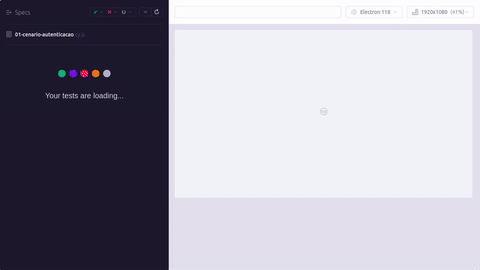
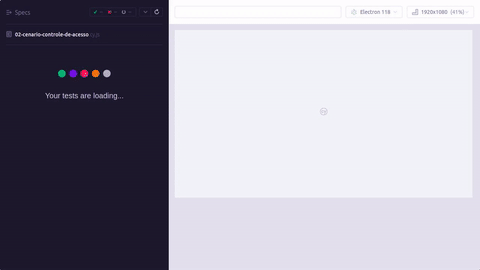
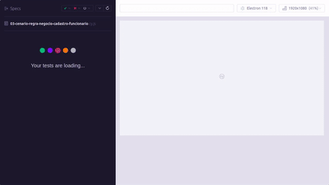

# Testes Automatizados – OrangeHRM

Automação de testes E2E do sistema [OrangeHRM (ambiente de demonstração)](https://opensource-demo.orangehrmlive.com/web/index.php/auth/login), desenvolvida como parte do Trabalho Prático de Quality Assurance.

**Equipe Ctrl + Test**
- Camila Vargas
- Antonio Carlos
- Roberto Medeiros

---

## Tecnologias

| Recurso | Versão |
|---|---|
| [Cypress](https://www.cypress.io/) | ^13.13.0 |
| Node.js | 18 ou superior |

---

## Variáveis de ambiente

O projeto **não** possui a URL do sistema nem as credenciais de teste fixas no código. Esses valores ficam em um arquivo `cypress.env.json`, que fica de fora do repositório (está no `.gitignore`) para não versionar dados sensíveis.

### Como configurar

1. Copie o arquivo de exemplo:
   ```bash
   cp cypress.env.json.example cypress.env.json
   ```
2. Abra `cypress.env.json` e preencha com os valores desejados:
   ```json
   {
     "baseUrl": "https://opensource-demo.orangehrmlive.com",
     "usuarioValido": {
       "username": "Admin",
       "password": "admin123"
     }
   }
   ```
3. Pronto — ao rodar `npm run cypress:open` ou `npm run cypress:run`, o Cypress lê automaticamente esse arquivo.

### O que cada variável controla

| Variável | Onde é usada |
|---|---|
| `baseUrl` | URL base de todas as visitas (`cy.visit`, `baseUrl` do Cypress). Definida em `cypress.config.js` via `setupNodeEvents`. |
| `usuarioValido.username` / `usuarioValido.password` | Credenciais usadas em `cy.login()` e nos casos de login com sucesso (Cenário 01). |

Se o arquivo `cypress.env.json` não existir, o projeto continua funcionando normalmente: cada configuração cai em um valor padrão (o mesmo ambiente de demonstração público do OrangeHRM), definido em `cypress.config.js` e em `cypress/fixtures/dados.json`.

> Também é possível sobrescrever qualquer variável na hora de rodar, sem editar arquivo nenhum, usando a flag `--env`:
> ```bash
> npx cypress run --env baseUrl=https://outra-url.com
> ```

---

## Regra de negócio validada

O trabalho exige que ao menos um cenário automatizado valide uma **regra de negócio** do sistema. A regra identificada e automatizada neste projeto é:

> **RN01 – Identificação obrigatória e única do funcionário**
>
> Todo funcionário cadastrado no módulo PIM deve possuir obrigatoriamente nome (*First Name*) e sobrenome (*Last Name*) e receber um identificador (*Employee Id*) único dentro do sistema. O sistema deve impedir a conclusão de qualquer cadastro que viole uma dessas condições, garantindo que não existam funcionários sem identificação ou com identificadores duplicados.

Essa regra é validada integralmente no **Cenário 03**, que exercita tanto o fluxo em que a regra é atendida (cadastro válido) quanto os três fluxos em que ela deve ser aplicada pelo sistema (ausência de nome, ausência de sobrenome e identificador duplicado).

---

## Cenários e casos de teste automatizados

O projeto possui **4 cenários**, cada um com **no mínimo 3 casos de teste automatizados**, derivados da **Especificação de Testes** do projeto.

### Cenário 01 – Autenticação (Login)
`cypress/e2e/01-cenario-autenticacao.cy.js`



| Caso | Descrição |
|---|---|
| CT001 | Login com credenciais válidas |
| CT002 | Login com senha inválida |
| CT003 | Login com o campo Username em branco |
| CT004 | Login com Username e Password em branco |

### Cenário 02 – Controle de Sessão e Acesso
`cypress/e2e/02-cenario-controle-de-acesso.cy.js`



| Caso | Descrição |
|---|---|
| CT001 | Acesso à URL do módulo PIM sem autenticação |
| CT002 | Acesso à URL do módulo Admin sem autenticação |
| CT003 | Encerramento de sessão pelo logout |

### Cenário 03 – Regra de Negócio RN01: Cadastro de Funcionário (PIM)
`cypress/e2e/03-cenario-regra-negocio-cadastro-funcionario.cy.js`



| Caso | Descrição |
|---|---|
| CT001 | Cadastro com dados válidos (fluxo principal da regra) |
| CT002 | Cadastro sem o campo obrigatório First Name |
| CT003 | Cadastro sem o campo obrigatório Last Name |
| CT004 | Cadastro com Employee Id duplicado |

### Cenário 04 – Pesquisa de Usuários do Sistema (Admin)
`cypress/e2e/04-cenario-pesquisa-usuarios.cy.js`


| Caso | Descrição |
|---|---|
| CT001 | Pesquisa pelo Username exato |
| CT002 | Pesquisa por Username inexistente |
| CT003 | Limpeza dos filtros pelo botão Reset |
| CT004 | Pesquisa parcial pela letra inicial — reproduz o **BUG002** (desativado) |

**Total:** 15 casos de teste, sendo 14 ativos e 1 desativado.

### Observação sobre o BUG002

O caso CT004 do Cenário 04 está marcado com `.skip` porque reproduz o defeito **BUG002** já registrado na Especificação de Bugs (o campo `Username` não aceita busca parcial pela letra inicial). Ele permanece desativado para que a suíte não acuse falha por um defeito conhecido. Após a correção do sistema, basta remover o `.skip` para que o teste valide o comportamento esperado.

---

## Como executar o projeto

### 1. Pré-requisitos
- [Node.js](https://nodejs.org/) 18 ou superior instalado
- [Git](https://git-scm.com/) instalado

### 2. Clonar o repositório
```bash
git clone https://github.com/Camila-Vargas-Nunes/avantibootcampsquad5.git
cd avantibootcampsquad5
```

### 3. Instalar as dependências
```bash
npm install
```

### 4. Executar os testes

**Modo interativo** (abre a interface do Cypress, ideal para acompanhar a execução):
```bash
npm run cypress:open
```
Em seguida, selecione **E2E Testing**, escolha o navegador e clique no arquivo de teste desejado.

**Modo headless** (executa todos os testes no terminal, usado na integração contínua):
```bash
npm run cypress:run
```

### 5. Gravação em vídeo da execução

O projeto está configurado com `video: true`. Ao executar no modo headless, o Cypress grava automaticamente um vídeo de cada arquivo de teste:

```bash
npm run cypress:run
```

Os arquivos são salvos em `cypress/videos/`, um `.mp4` por spec:

```
cypress/videos/
├── 01-cenario-autenticacao.cy.js.mp4
├── 02-cenario-controle-de-acesso.cy.js.mp4
├── 03-cenario-regra-negocio-cadastro-funcionario.cy.js.mp4
└── 04-cenario-pesquisa-usuarios.cy.js.mp4
```

> A pasta `cypress/videos/` está no `.gitignore` e não é enviada ao repositório, evitando arquivos pesados gerados a cada execução local. Uma cópia de referência fica versionada em `docs/videos/` (vídeo completo de cada cenário) e `docs/gifs/` (prévia em GIF, exibida diretamente em cada cenário na seção **Cenários e casos de teste automatizados** acima).

Caso prefira gravar a tela com narração, execute `npm run cypress:open` (modo interativo) e utilize um gravador de tela — a execução fica visível passo a passo na interface do Cypress.

---

## Estrutura do projeto

```
orangehrm-testes-automatizados/
├── .github/
│   └── workflows/
│       └── cypress.yml              # Execução automática dos testes no GitHub Actions
├── docs/
│   ├── gifs/                        # GIFs de prévia da execução de cada cenário (exibidos no README)
│   └── videos/                      # Vídeos completos de referência da execução de cada cenário
├── cypress/
│   ├── e2e/                         # Arquivos de teste (um por cenário)
│   │   ├── 01-cenario-autenticacao.cy.js
│   │   ├── 02-cenario-controle-de-acesso.cy.js
│   │   ├── 03-cenario-regra-negocio-cadastro-funcionario.cy.js
│   │   └── 04-cenario-pesquisa-usuarios.cy.js
│   ├── fixtures/
│   │   └── dados.json               # Massa de dados usada nos testes
│   └── support/
│       ├── commands.js              # Comandos customizados (login, navegação)
│       └── e2e.js                   # Configurações globais
├── cypress.config.js                # Configuração do Cypress
├── cypress.env.json.example         # Modelo das variáveis de ambiente (versionado)
├── cypress.env.json                 # Variáveis de ambiente reais (fora do git)
├── package.json
├── package-lock.json                # Lockfile das dependências (versionado para builds reproduzíveis no CI)
└── README.md
```

---

## Credenciais do ambiente de demonstração

| Campo | Valor |
|---|---|
| Username | `Admin` |
| Password | `admin123` |

Essas são as mesmas credenciais públicas do ambiente de demonstração do OrangeHRM, usadas como valor padrão em `cypress.env.json.example` (veja a seção **Variáveis de ambiente** acima).

> O ambiente é público e reiniciado periodicamente pela OrangeHRM. Registros criados durante os testes podem ser removidos sem aviso, e a instabilidade eventual do site pode causar falhas não relacionadas ao código.

> O Cenário 03 cria funcionários no ambiente de demonstração para validar a regra RN01. Os nomes e identificadores utilizados recebem um sufixo numérico gerado a cada execução, evitando conflito entre rodadas consecutivas.
